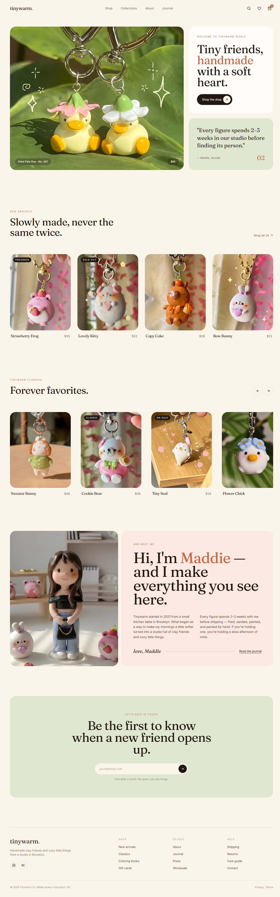

<div align="center">
  <h1>Tinywarm — Web Template</h1>
  
</div>

a cute, fully-responsive desk friend & cozy things storefront template built with React, TypeScript, Tailwind CSS, TanStack Router, and Framer Motion. a warm little space ready to make your own.



## what's inside

✦ editorial hero showcasing featured handmade friends

✦ new arrivals grid with hover effects and status badges

✦ infinite classics carousel with custom navigation & autoplay controls

✦ cozy "meet the maker" story section

✦ smooth scroll reveal animations


## getting started

1. download or clone the project
2. install dependencies:
   ```bash
   npm install
   # or using bun
   bun install
   ```
3. start the development server:
   ```bash
   npm run dev
   # or using bun
   bun dev
   ```
4. open the local server URL (usually `http://localhost:5173`) in your browser


## project structure

```
tinywarm-shop-web-template/
├── src/
│   ├── assets/       # cozy webp images & mockups
│   ├── components/   # modular layout & landing components
│   ├── hooks/        # custom react hooks
│   ├── lib/          # helper utils and configurations
│   ├── routes/       # file-based routes (root, home index)
│   ├── main.tsx      # application entrypoint
│   └── styles.css    # tailwind imports & base styles
├── index.html        # html shell
├── package.json      # scripts & package dependencies
└── vite.config.ts    # vite configurations
```

feel free to build something with it ;)
